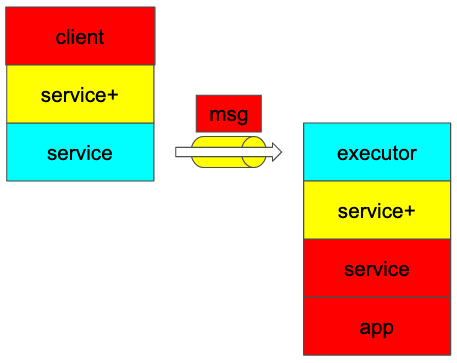

# Architecture

norpc utilizes Tower ecosystem.

The core of the Tower ecosystem is an abstraction called `Service` which is like a function from request to response.
The ecosystem has many decorator stacks to add new behavior to an existing `Service`.

In the diagram, client requests are coming from the top-left of the stacks and flow down to the bottom-right.
The client and server is connected by async channel driven by some async runtime (like Tokio) so there is no overhead for
the serialization and copying because the messages just "move".

