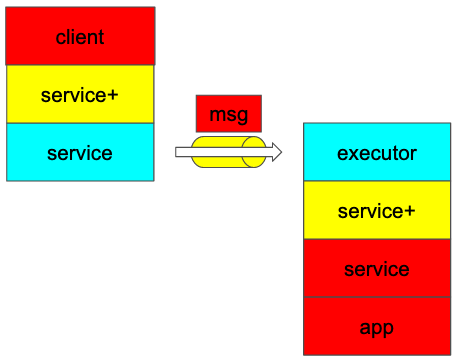

# Compiler



The stacks in red is generated by the compiler which utilizes Rust's procedural macros.

You can define your service by `norpc::service` macro which generates
code in build time.
The generated code includes message type, client type
and server-side `Service` type.

```rust
#[norpc::service]
trait HelloWorld {
    fn hello(s: String) -> String;
}
```

Note that these types are runtime-agnostic which means you can run this service
in any runtime other than default Tokio runtime such as
[glommio](https://github.com/DataDog/glommio) or [monoio](https://github.com/bytedance/monoio).