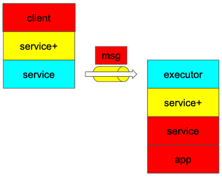

# Compiler



The stacks in red is generated by compiler which utilizes Rust's procedural macros.

You can define your service by `norpc::service` macro which generates
code in build time.
The generated code includes message type, client type
and server-side `Service` type.

```rust
#[norpc::service]
trait HelloWorld {
    fn hello(s: String) -> String;
}
```

Note that these types are runtime-agnostic which means you can run these types
in any runtime including the default tokio runtime.

## non-Send support

You can generate non-Send service by add `?Send` parameter to `norpc::service` macro.

This is useful when you want to run the service in pinned thread.
Some runtime requires non-Send type for this reason.

```rust
#[norpc::service(?Send)]
trait HelloWorldLocal {
    // Rc<T> is !Send
    fn hello(s: Rc<String>) -> Rc<String>;
}
```

## Stream support

Stream type is also supported but note that stream is moved through channel.
This means failing on server-side fails entire streaming on client-side and vice versa.

```rust
#[norpc::service]
trait BidiStreaming {
    fn double(input: Stream<u64>) -> Stream<u64>;
}
```